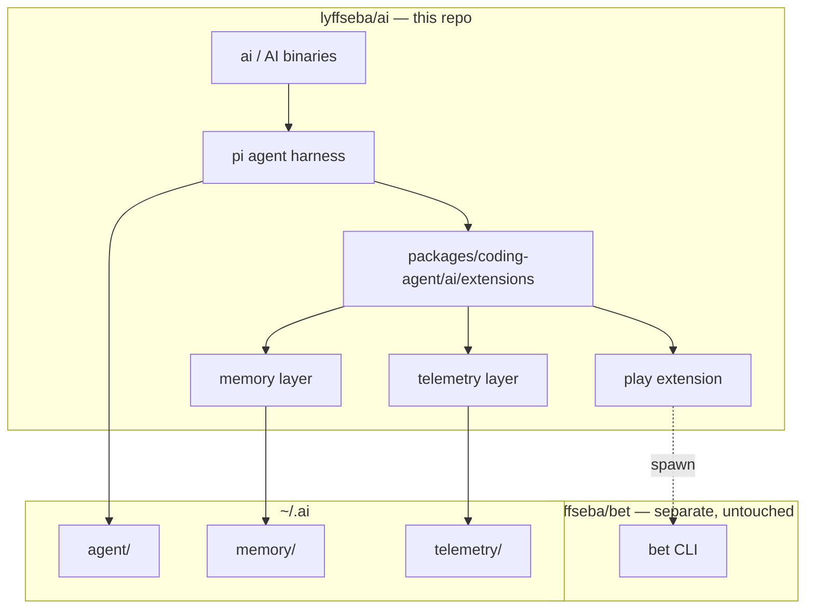

# Architecture

**ai** is a unified pi fork. Everything lives in this repo except bet.

## Bundled extensions

| File | Role |
|------|------|
| `mode.ts` | `ai` / `AI` / `--fast` system prompts |
| `memory.ts` | Cross-session memory + `/memory` |
| `telemetry.ts` | Local events + `/telemetry` |
| `play.ts` | `/play`, `/leaderboard` → spawns bet if installed |

## What is NOT in this repo

| Project | Relationship |
|---------|--------------|
| bet | Spawned by `/play`. Never merged. |
| pi-upstream | Reference only |
| tyypin (Rust) | Superseded experiment |